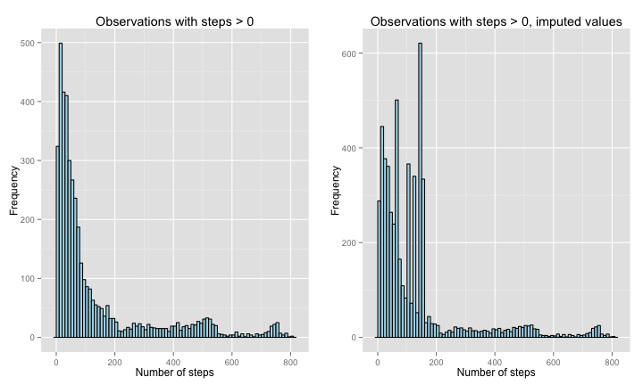

# Reproducible Research: Peer Assessment 1

Report made as part of the course Reproducible Research, given by Roger D. Peng, Jeff Leek and Brian Caffo, on its August 2014 iteration.

The code and text below encompass the activities asked as part of the peer assessment 1 of the course, sent for evaluation on the August, 17th, 2014.

## Loading and preprocessing the data  
The first action is to load the data from an activity monitoring device used to collect data at a 5 minute interval. As explained in the assignment description, the data consists of two months of measurements from an anonymous individual collected during October and November, 2012 and include the number of steps taken in 5 minute intervals each day.

The original format of the data is a compressed zip file; the code below decompresses it and returns the folder contents after the operation, listing the newly created csv file.


```r
unzip("activity.zip")
list.files(pattern="activity.*")
```

```
## [1] "activity.csv" "activity.zip"
```

After creating the csv file, the data have to be loaded into R. The code below does that and gives a summary.


```r
stepsDF = read.csv("activity.csv")
summary(stepsDF)
```

```
##      steps               date          interval   
##  Min.   :  0.0   2012-10-01:  288   Min.   :   0  
##  1st Qu.:  0.0   2012-10-02:  288   1st Qu.: 589  
##  Median :  0.0   2012-10-03:  288   Median :1178  
##  Mean   : 37.4   2012-10-04:  288   Mean   :1178  
##  3rd Qu.: 12.0   2012-10-05:  288   3rd Qu.:1766  
##  Max.   :806.0   2012-10-06:  288   Max.   :2355  
##  NA's   :2304    (Other)   :15840
```

```r
str(stepsDF)
```

```
## 'data.frame':	17568 obs. of  3 variables:
##  $ steps   : int  NA NA NA NA NA NA NA NA NA NA ...
##  $ date    : Factor w/ 61 levels "2012-10-01","2012-10-02",..: 1 1 1 1 1 1 1 1 1 1 ...
##  $ interval: int  0 5 10 15 20 25 30 35 40 45 ...
```

The class of the variable **date** is factor, which might not be suitable for the analysis as comparisons and operations on dates would be hindered. The code below converts the date to the POSIXct type and show an updated summary of the data frame.


```r
#stepsDF$date = as.POSIXlt(strptime(as.character(stepsDF$date), "%Y-%m-%d"))
str(stepsDF)
```

```
## 'data.frame':	17568 obs. of  3 variables:
##  $ steps   : int  NA NA NA NA NA NA NA NA NA NA ...
##  $ date    : Factor w/ 61 levels "2012-10-01","2012-10-02",..: 1 1 1 1 1 1 1 1 1 1 ...
##  $ interval: int  0 5 10 15 20 25 30 35 40 45 ...
```

## What is mean total number of steps taken per day?

In this section, two questions will be answered:

**First: What is the frequency of the total number of daily steps?**

The histogram on the left side of the panel below illustrates the frequency of numbers of steps in all observations. As there is a significant amount of observations with number of stepd equal to zero, a more illustrative graph is given by the histogram on the rigth side, which takes into account only the observations with number of steps greater than zero.


```r
library(ggplot2)
library(gridExtra)
```

```
## Loading required package: grid
```

```r
ghist1 = ggplot(stepsDF, aes(x=steps)) + geom_histogram(binwidth=10, colour="black", fill="lightblue") 
ghist1 = ghist1 + xlab("Number of steps") + ylab("Frequency") + ggtitle("All observations")
ghist2 = ggplot(subset(stepsDF, steps > 0), aes(x=steps)) + geom_histogram(binwidth=10, colour="black", fill="lightblue")
ghist2 = ghist2 + xlab("Number of steps") + ylab("Frequency") + ggtitle("Observations with steps > 0")
grid.arrange(ghist1, ghist2, ncol=2)
```

 


**Second: What is the mean and median total number of steps taken per day?**


```r
nonZeroObservations = subset(stepsDF, steps > 0)
meanSteps = mean(stepsDF$steps, na.rm=TRUE)
medianSteps = median(stepsDF$steps, na.rm=TRUE)
meanNonZero = mean(nonZeroObservations$steps, na.rm=TRUE)
medianNonZero = median(nonZeroObservations$steps, na.rm=TRUE)
c(meanSteps, medianSteps, meanNonZero, medianNonZero)
```

```
## [1]  37.38   0.00 134.26  56.00
```

As calculated in the code above, the mean steps taken in the observed period was **37.38** and the median was **0**. But due to the large amount of observations with zero steps recorded, a more telling statistic can be draw from the subset of the original data with number of steps greater than zero, where the mean is equal to **134.26** and the median is equal to **56**.

## What is the average daily activity pattern?

The panel below illustrates the number of steps taken, in average, in eacho interval during the day. The grpah on the left takes into account all the non-NA observations; the one on the right takes into account only the observations with a number of steps greater than zero.


```r
library(ggplot2)
library(gridExtra)
nonNAObservations = subset(stepsDF, !is.na(steps))
aggregateSteps = aggregate(nonNAObservations$steps, list(interval = nonNAObservations$interval), mean)
#plot(aggregateSteps$interval, aggregateSteps$x, type="l")
plot1 = ggplot(aggregateSteps, aes(x=interval, y=x)) + geom_line() + xlab("Time interval") + ylab("Steps") + ggtitle("Mean steps per interval, all observations")

nonZeroObservations = subset(stepsDF, steps > 0)
aggregateNonZeroSteps = aggregate(nonZeroObservations$steps, list(interval = nonZeroObservations$interval), mean)
#plot(aggregateNonZeroSteps$interval, aggregateNonZeroSteps$x, type="l")
plot2 = ggplot(aggregateNonZeroSteps, aes(x=interval, y=x)) + geom_line() + xlab("Time interval") + ylab("Steps") + ggtitle("Mean steps per interval, steps > 0")
grid.arrange(plot1, plot2, ncol=2)
```

 

The code below orders the aggregate data frame create above **with the observations greater than zero**, allowing the identification of the interval with the maximum number of steps.


```r
maxSteps = aggregateNonZeroSteps[with(aggregateNonZeroSteps, order(aggregateNonZeroSteps$x, decreasing=TRUE)),]
head(maxSteps, n=3)
```

```
##    interval     x
## 86      835 352.5
## 89      850 324.0
## 88      845 307.0
```

The interval **835** has the maximum steps, with an mean of **352.48** steps over the observed period.


## Imputing missing values

Number of NAs in the data set:


```r
tableNAs = table(is.na(stepsDF$steps))
tableNAs
```

```
## 
## FALSE  TRUE 
## 15264  2304
```
Number of NAs in the data set is equal to **2304**


Impute the NAs with the mean, disregarding zeros:


```r
newStepsDF = stepsDF
nonZeroSubset = subset(newStepsDF, steps > 0)
newStepsDF$steps[is.na(newStepsDF$steps)] = mean(nonZeroSubset$steps)
```

Replacing the NAs by the mean of non zero observations has a significant impact. The histogram below shows that by a huge peak on the mean value.


```r
library(ggplot2)
library(gridExtra)
ghist1 = ggplot(newStepsDF, aes(x=steps)) + geom_histogram(binwidth=10, colour="black", fill="lightblue") 
ghist1 = ghist1 + xlab("Number of steps") + ylab("Frequency") + ggtitle("All observations")
ghist2 = ggplot(subset(newStepsDF, steps > 0), aes(x=steps)) + geom_histogram(binwidth=10, colour="black", fill="lightblue")
ghist2 = ghist2 + xlab("Number of steps") + ylab("Frequency") + ggtitle("Observations with steps > 0")
grid.arrange(ghist1, ghist2, ncol=2)
```

 
## Are there differences in activity patterns between weekdays and weekends?

NA
